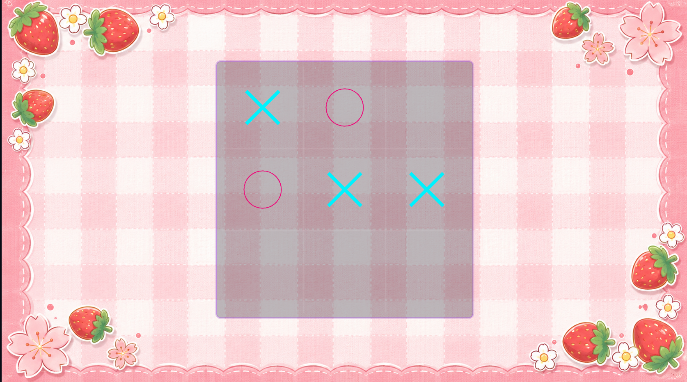
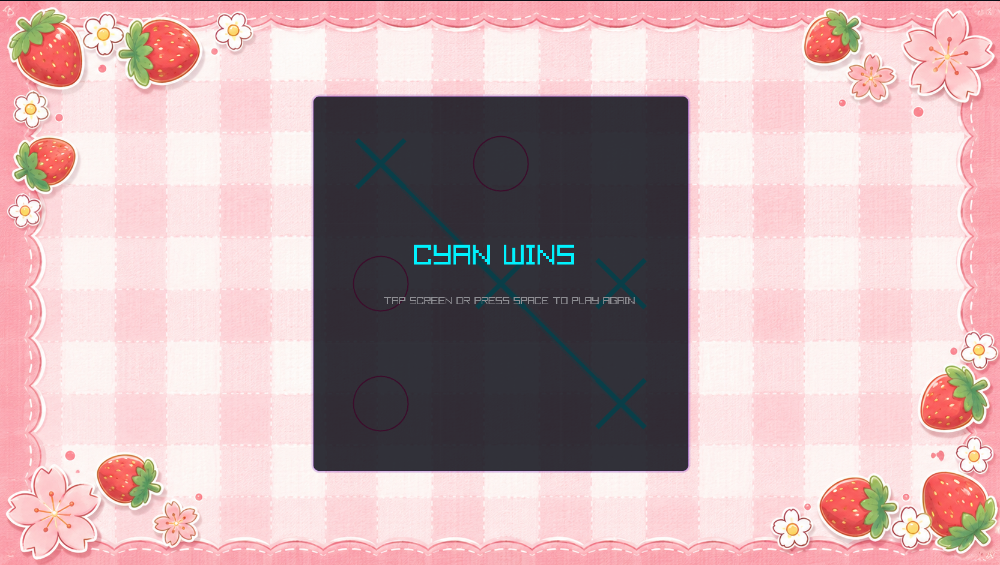

# Tic-Tac-Toe (C++ & Raylib)

A custom-themed Tic-Tac-Toe game built using **C++** and the **Raylib** graphics library.

## Features

- Styled grid layout with custom background
- Two-player turn-based system ($X$ and $O$)
- Responsive grid click detection
- Custom retro audio sound effects
- Turn indicators, win checking, and tie-game logic
- Smooth rendering powered by hardware acceleration

## Screenshots

### Gameplay

### Game Over

## Controls

| Key | Action |
|-----|--------|
| Left Mouse Click | Place Mark ($X$ or $O$) |
| R | Restart Game |
| Escape | Exit Game |

## Technologies Used

- C++
- Raylib
- Visual Studio Code
- Git & GitHub

## Project Structure